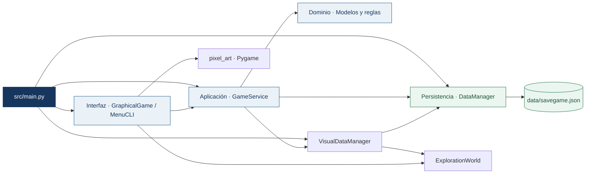
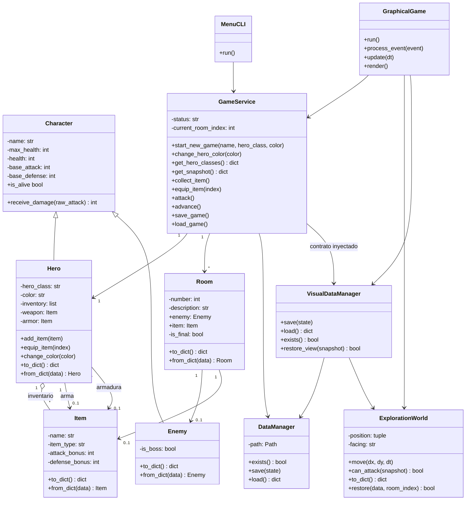
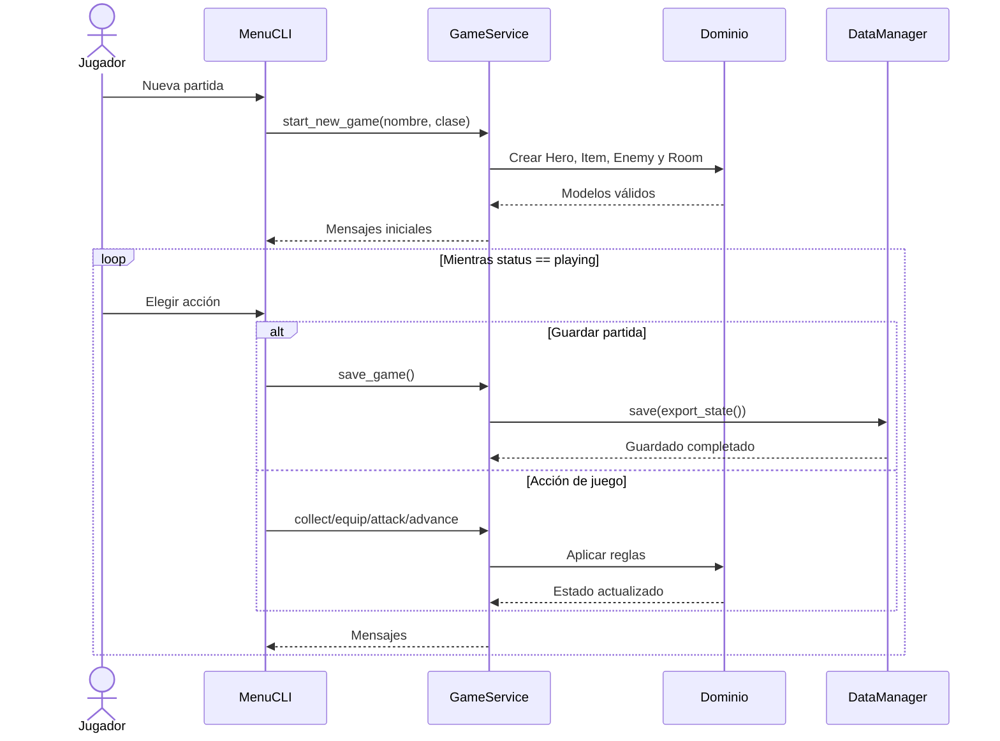

# Arquitectura de Pixel Quest

Pixel Quest utiliza arquitectura en capas. Las dependencias apuntan hacia el dominio; ninguna clase del dominio conoce la consola, los archivos JSON o los servicios.

## Capas



Reglas de dependencia:

- `src/domain` no importa servicios, UI, JSON, `input` ni `print`.
- `GameService` utiliza modelos y recibe persistencia por inyección.
- `MenuCLI` utiliza la API pública de `GameService` y captura excepciones controladas; no accede a modelos ni a `DataManager`.
- `GraphicalGame` usa esa misma API para combatir, recoger, equipar y personalizar. Maneja las animaciones y eventos sin calcular daño ni alterar directamente al héroe.
- `ExplorationWorld` controla coordenadas, alcance visual y colisiones. No conoce los modelos de combate ni necesita Pygame.
- `VisualDataManager` implementa el contrato de persistencia e incorpora `view` al JSON; el estado visual se aplica solo después de una restauración válida del dominio.
- `pixel_art.py` dibuja recursos originales con Pygame. Dominio y Servicios no dependen de ese paquete.
- `main.py` ensambla las capas sin contener reglas del juego.

## Diagrama de clases



## Secuencia de una partida



## Contrato de persistencia

| Campo | Tipo | Regla |
|---|---|---|
| `version` | entero | Debe ser exactamente `1`. |
| `status` | texto | `playing`, `victory` o `defeat`. |
| `current_room` | entero | Índice existente dentro de `rooms`. |
| `hero` | objeto | Incluye nombre, clase, vida, estadísticas, inventario y equipo. |
| `rooms` | lista no vacía | Cada habitación incluye número, descripción, enemigo, objeto y `is_final`. |
| `hero.color` | texto opcional | RGB hexadecimal `#RRGGBB`; si falta, usa el color de la clase. |
| `view` | objeto opcional | Versión visual, índice de sala, posición y orientación. |

La lista debe contener un único jefe final vivo mientras la partida esté en curso. El jefe debe estar en la última habitación. Una victoria requiere al héroe vivo, ubicado en esa habitación, con el jefe derrotado.

`DataManager` valida el contenedor JSON. `GameService` valida el significado del estado y reconstruye los modelos.

La ampliación conserva `version: 1`: color y vista son adiciones compatibles. `VisualDataManager` agrega `view` en una copia del estado sin mutar el original. Una posición fuera de la sala, dentro de una columna o enemigo, no finita o perteneciente a otra habitación se descarta y el héroe vuelve a la entrada. Un color inválido sí invalida el dominio guardado y conserva intacta la partida actual.

## Flujo gráfico de un turno

```mermaid
sequenceDiagram
    actor J as Jugador
    participant G as GraphicalGame
    participant W as ExplorationWorld
    participant S as GameService
    J->>G: WASD / flechas
    G->>W: move(dirección, dt)
    W-->>G: Posición limitada por paredes y columnas
    J->>G: Espacio
    G->>W: can_attack(snapshot)
    W-->>G: Enemigo cercano
    G->>S: attack()
    S-->>G: Ataque, contraataque y estado del encuentro
    G->>G: Animar turno; bloquear ataques repetidos
    G-->>J: Vida, daño flotante y victoria/derrota
```

## Aislamiento por célula

- **Dominio:** `Hero.color`, `change_color()` y `validate_color()`.
- **Servicios:** catálogo de clases para la vista y caso de uso `change_hero_color()`.
- **Interfaz/Integración:** renderizado, exploración, persistencia visual y arranque.
- **Integrador:** dependencias, documentación y pruebas cruzadas.

La configuración local `.vscode/` y el entorno `.venv/` están excluidos de Git. Los cambios se encuentran en una rama local de funcionalidad; los prompts y evidencias se preparan para la revisión del equipo.
