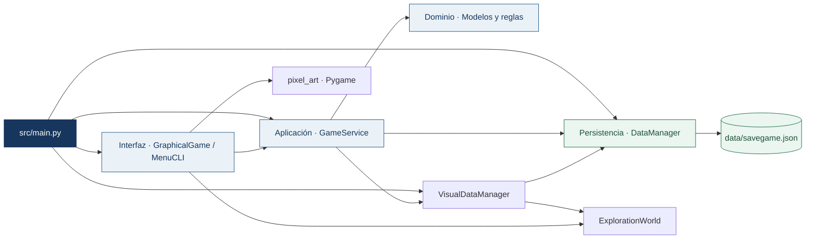
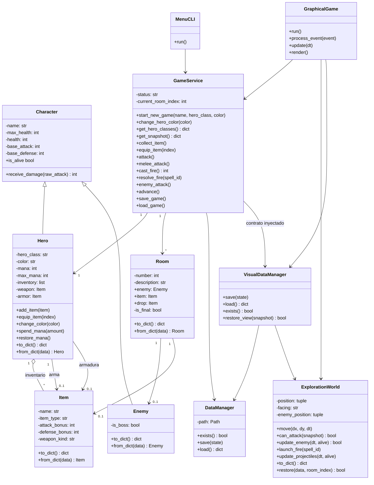
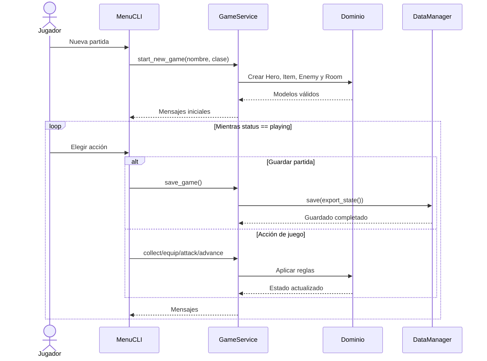

# Arquitectura de Pixel Quest

Pixel Quest utiliza arquitectura en capas. Las dependencias apuntan hacia el dominio; ninguna clase del dominio conoce la consola, los archivos JSON o los servicios.

## Capas



Reglas de dependencia:

- `src/domain` no importa servicios, UI, JSON, `input` ni `print`.
- `GameService` utiliza modelos y recibe persistencia por inyección.
- `MenuCLI` utiliza la API pública de `GameService` y captura excepciones controladas; no accede a modelos ni a `DataManager`.
- `GraphicalGame` usa esa misma API para combatir, recoger, equipar y personalizar. Maneja las animaciones y eventos sin calcular daño ni alterar directamente al héroe.
- `ExplorationWorld` controla coordenadas, alcance visual y colisiones. No conoce los modelos de combate ni necesita Pygame.
- `VisualDataManager` implementa el contrato de persistencia e incorpora `view` al JSON; el estado visual se aplica solo después de una restauración válida del dominio.
- `pixel_art.py` dibuja recursos originales con Pygame. Dominio y Servicios no dependen de ese paquete.
- `main.py` ensambla las capas sin contener reglas del juego.

## Diagrama de clases



## Secuencia de una partida de consola



## Contrato de persistencia

| Campo | Tipo | Regla |
|---|---|---|
| `version` | entero | Exporta `2`; acepta `1` mediante migración explícita. |
| `status` | texto | `playing`, `victory` o `defeat`. |
| `current_room` | entero | Índice existente dentro de `rooms`. |
| `hero` | objeto | Incluye nombre, clase, vida, estadísticas, inventario y equipo. |
| `rooms` | lista no vacía | Cada habitación incluye número, descripción, enemigo, objeto y `is_final`. |
| `hero.color` | texto opcional | RGB hexadecimal `#RRGGBB`; si falta, usa el color de la clase. |
| `hero.mana` / `hero.max_mana` | enteros | Mago: 0–100 / 100; Guerrero: 0 / 0. |
| `weapon_kind` | texto | `sword` o `staff` para armas; `null` para armaduras. |
| `rooms[].drop` | objeto opcional | Botín pendiente de un enemigo vivo; se mueve a `item` al morir. |
| `view` | objeto opcional | Versión visual 2, sala, posiciones, orientación, ubicación de botín e intervalos restantes. |

La lista debe contener un único jefe final vivo mientras la partida esté en curso. El jefe debe estar en la última habitación. Una victoria requiere al héroe vivo, ubicado en esa habitación, con el jefe derrotado.

`DataManager` valida el contenedor JSON. `GameService` valida el significado del estado y reconstruye los modelos.

`GameService._migrate_state()` convierte una copia del guardado v1 a v2: inicializa maná por clase, identifica el bastón del Mago y mueve la armadura preexistente de un Goblin vivo a `drop`. No regenera objetos recogidos ni recompensa enemigos que ya estaban muertos. El guardado original no se modifica al cargar.

`VisualDataManager` agrega `view` sobre una copia sin mutar el dominio. `ExplorationWorld.restore()` acepta vistas v1 y v2. Posiciones no finitas, fuera de límites, dentro de rocas o solapadas con un enemigo vivo provocan restauración visual a las entradas. Los campos de dominio dañados rechazan la carga y conservan la partida activa.

Los proyectiles son transitorios: `cast_fire()` consume 15 de maná y registra un identificador de impacto único. El mundo resuelve trayectoria/colisión y llama a `resolve_fire()` o `cancel_fire()`. Guardar, cargar o avanzar se bloquea mientras exista un hechizo pendiente; no se pierde un impacto al restaurar ni se duplica una recompensa.

## Flujo gráfico en tiempo real

```mermaid
sequenceDiagram
    actor J as Jugador
    participant G as GraphicalGame
    participant W as ExplorationWorld
    participant S as GameService
    J->>G: WASD / flechas
    G->>W: move(dirección, dt)
    W-->>G: Posición limitada por paredes y rocas
    J->>G: Espacio
    G->>W: can_attack(snapshot)
    W-->>G: Alcance y línea de visión válidos
    alt Guerrero
        G->>S: melee_attack()
    else Mago
        G->>S: cast_fire()
        S-->>G: Identificador; maná consumido
        G->>W: launch_fire(id)
        W-->>G: Impacto o fallo
        G->>S: resolve_fire(id) o cancel_fire(id)
    end
    G->>W: update_enemy(dt, alive)
    W-->>G: Contacto cuando finaliza el intervalo de golpe
    G->>S: enemy_attack()
    G-->>J: Vida, daño flotante y victoria/derrota
```

## Aislamiento por célula

- **Dominio:** apariencia, maná, identificación de armas y botín pendiente.
- **Servicios:** ataques separados, autorización de fuego, recompensas y migración v1/v2.
- **Interfaz/Integración:** cinematográfica, iluminación, navegación por cuadrícula, colisiones, proyectiles y persistencia visual.
- **Integrador:** dependencias, documentación y pruebas cruzadas.

La configuración local `.vscode/` y el entorno `.venv/` están excluidos de Git. Los cambios se encuentran en una rama local de funcionalidad; los prompts y evidencias se preparan para la revisión del equipo.

`OpeningCinematic` avanza con tiempo de simulación: aparición de 1,5 s, lectura de 2 s, desaparición de 1,3 s y separación de 0,45 s por mensaje. La exploración permanece detenida durante la secuencia. La pausa detiene también proyectiles, persecución e intervalos. La iluminación se aplica a la escena de la cueva y a sus actores; el HUD y los textos permanecen legibles fuera de la máscara de luz.
