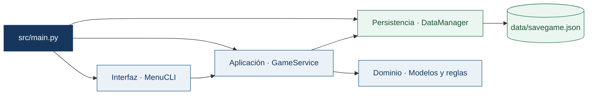
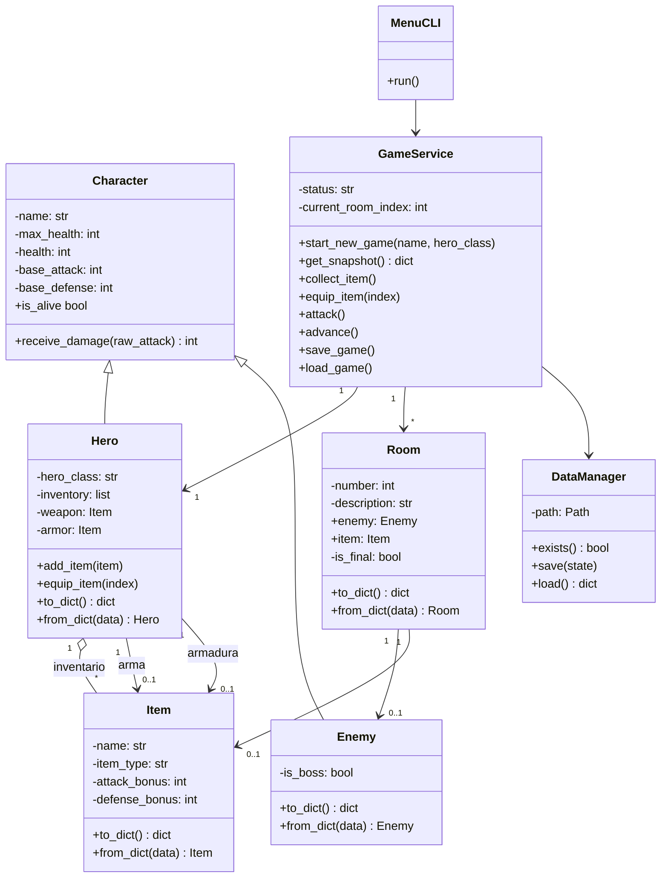
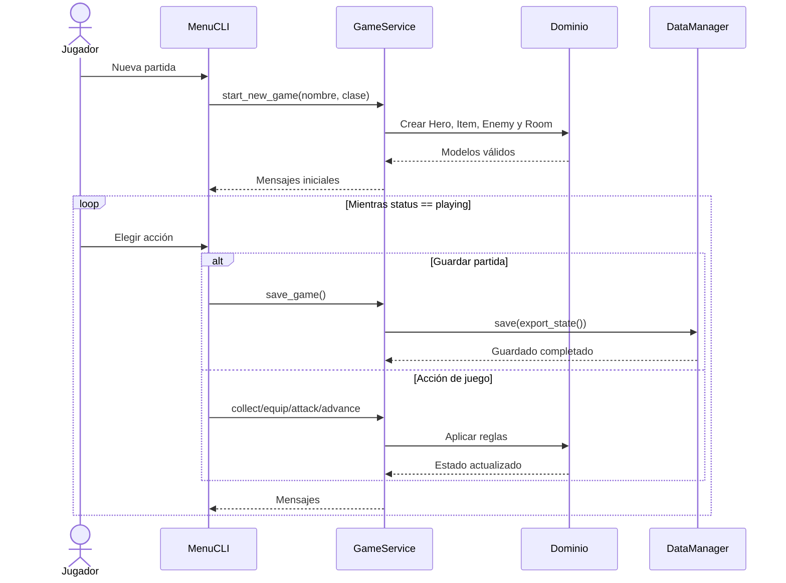

# Arquitectura de Pixel Quest

Pixel Quest utiliza arquitectura en capas. Las dependencias apuntan hacia el dominio; ninguna clase del dominio conoce la consola, los archivos JSON o los servicios.

## Capas

Reglas de dependencia:

- `src/domain` no importa servicios, UI, JSON, `input` ni `print`.
- `GameService` utiliza modelos y recibe persistencia por inyección.
- `MenuCLI` utiliza la API pública de `GameService` y captura excepciones controladas; no accede a modelos ni a `DataManager`.
- `main.py` ensambla las capas sin contener reglas del juego.

## Diagrama de clases

## Secuencia de una partida

## Contrato de persistencia

| Campo | Tipo | Regla |
|---|---|---|
| `version` | entero | Debe ser exactamente `1`. |
| `status` | texto | `playing`, `victory` o `defeat`. |
| `current_room` | entero | Índice existente dentro de `rooms`. |
| `hero` | objeto | Incluye nombre, clase, vida, estadísticas, inventario y equipo. |
| `rooms` | lista no vacía | Cada habitación incluye número, descripción, enemigo, objeto y `is_final`. |

La lista debe contener un único jefe final vivo mientras la partida esté en curso. El jefe debe estar en la última habitación. Una victoria requiere al héroe vivo, ubicado en esa habitación, con el jefe derrotado.

`DataManager` valida el contenedor JSON. `GameService` valida el significado del estado y reconstruye los modelos.
